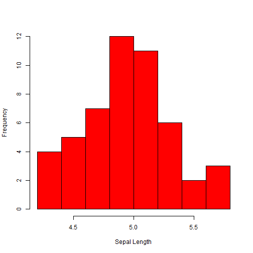

## Introduction

# Features of IRIS Species Type - plotting histogram and calculating mean/median

1. This application uses IRIS dataset in R 
2. Provides users with options to select species type
3. Provides users with options to select mean or median
4. Plots histograms of all features of selected species type
5. Calculates mean or median, as selected, of every feature of species type

--- 

## Algorithm Used

1. Take inputs from users at user interface
2. Send inputs to server
3. Run function for histogram plotting
4. Run function for mean/median calculation
5. Send output to user interface
6. Display plots and mean/median

---

## Example of a histogram plot


```r
data(iris)
hist(iris$Sepal.Length[iris$Species == "setosa"], main=NULL, xlab = "Sepal Length",col="red")
```



---

## Exampe of mean/median calculation


```r
          print(mean(iris$Sepal.Length[iris$Species=="setosa"]) )
```

```
## [1] 5.006
```

```r
          print(median(iris$Sepal.Width[iris$Species=="setosa"]))
```

```
## [1] 3.4
```


# Thank you!


